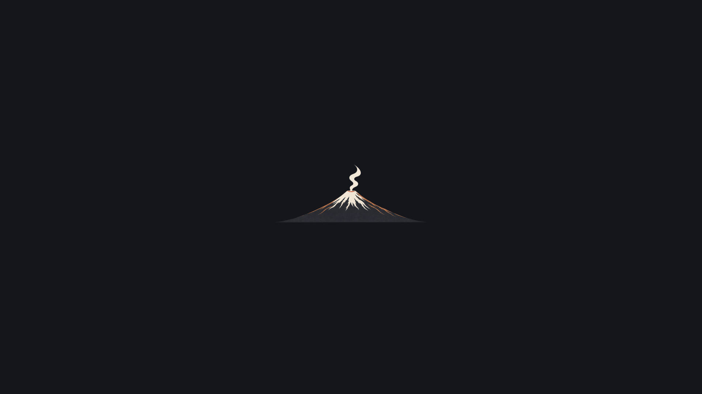
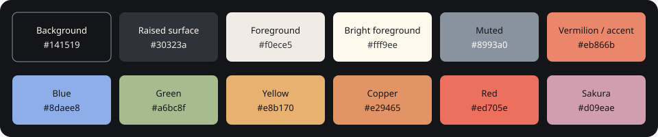

# Kuro Japan for Omarchy

A soft-black Japanese-inspired Omarchy theme with brighter Fuji-slate shadows,
warm ivory text, vermilion, copper, sakura, and sky-blue accents.




## Features

- Soft charcoal surfaces with a pure-black top bar
- Brighter accents matched to the bundled Fuji, Lawson, torii, castle, train,
  and Tokyo Tower wallpapers
- Six minimal Japan-inspired wallpapers with bright, open compositions
- Compact centered Mount Fuji unlock mark with a small smoke plume
- Generated terminal, shell, editor, browser, and system-tool themes through
  Omarchy's `colors.toml` templates

## Installation

From the Omarchy menu, open **Install > Style > Theme** and paste:

```text
https://github.com/R7rainz/kuro-japan.git
```

Or install from a terminal:

```bash
omarchy theme install https://github.com/R7rainz/kuro-japan.git
```

Apply the theme manually with:

```bash
omarchy theme set kuro-japan
```

## Wallpaper and unlock controls

Cycle wallpapers with:

```bash
omarchy theme bg next
```

The unlock artwork appears under **Style > Unlock**. `unlock.png` is the
transparent Plymouth mark; `preview-unlock.png` is the selector preview.

## Palette



| Role | Color |
| --- | --- |
| Background | `#141519` |
| Raised surface | `#30323a` |
| Foreground | `#f0ece5` |
| Bright foreground | `#fff9ee` |
| Muted | `#8993a0` |
| Vermilion / accent | `#eb866b` |
| Sky blue | `#8daee8` |
| Green | `#a6bc8f` |
| Copper | `#e29465` |
| Red | `#ed705e` |
| Sakura | `#d09eae` |

The palette lives in `colors.toml`; `shell.toml` keeps the top bar black.

## Theme layout

```text
kuro-japan/
├── backgrounds/                 # selectable wallpapers
│   ├── 05-mount-fuji-smoke.png
│   ├── 06-lawson-fuji.png
│   ├── 08-tokyo-tower.png
│   ├── 10-itsukushima-torii.png
│   ├── 11-himeji-castle.png
│   └── 12-fuji-train.png
├── colors.toml                  # palette source of truth
├── icons.theme                  # theme icon colors
├── shell.toml                   # black top bar
├── preview.png                  # theme-selector preview
├── unlock.png                   # transparent Plymouth mark
├── preview-unlock.png           # unlock-selector preview
├── palette.svg                  # documented palette preview
├── theme.yaml                   # repository/gallery metadata
├── LICENSE
├── NOTICE
└── README.md
```

`theme.yaml` is repository metadata for gallery and marketplace tooling;
Omarchy's runtime theme source remains `colors.toml`.

## Credits and licensing

The theme configuration, documentation, palette artwork, and project-created
wallpaper/unlock artwork are provided under the [Apache License 2.0](LICENSE).
The scenic artwork was created with AI assistance; no external wallpaper
downloads are intentionally bundled.

This project is independent and is not officially affiliated with Omarchy.

## Contributing

Issues and pull requests are welcome. Please include wallpaper/artwork source
or permission details when contributing new visual assets.
